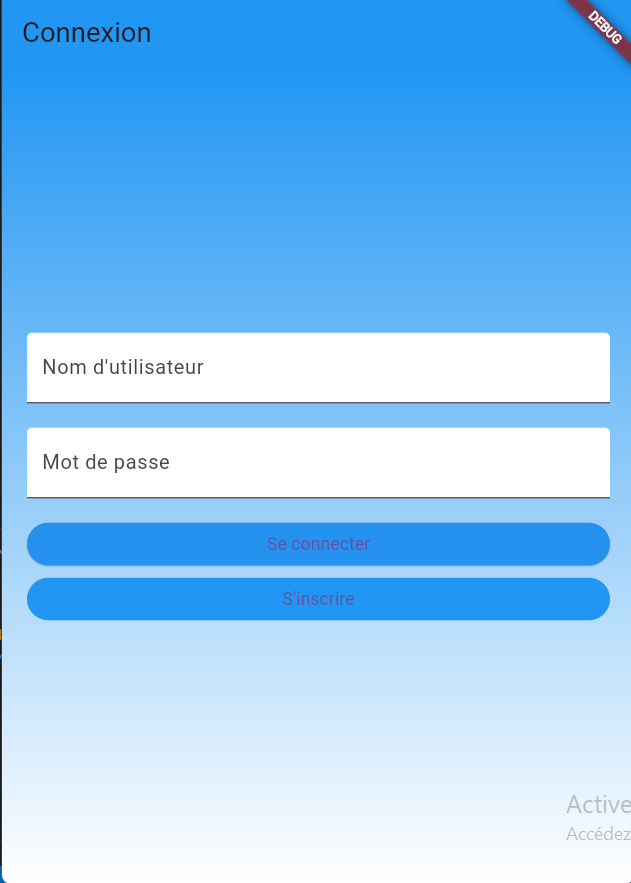
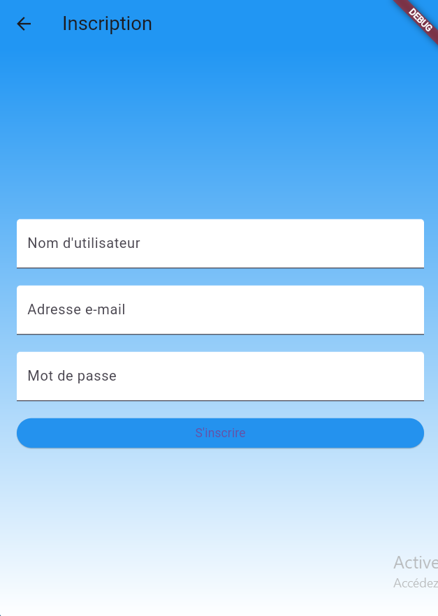
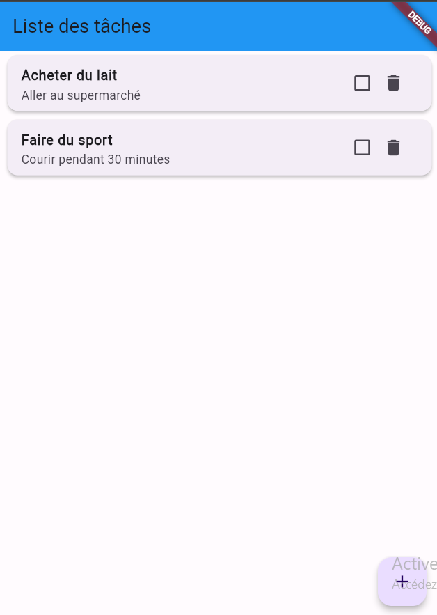

# Application ToDoList

## Description
Cette application ToDoList vous permet de gérer vos tâches quotidiennes de manière efficace. Vous pouvez vous inscrire, vous connecter et créer, modifier ou supprimer des tâches à faire.

## Fonctionnalités
- **Inscription**: Les utilisateurs peuvent créer un compte avec leur nom d'utilisateur, leur adresse e-mail et leur mot de passe.
- **Connexion**: Les utilisateurs peuvent se connecter avec leur nom d'utilisateur et leur mot de passe.
- **Liste des tâches**: Les utilisateurs peuvent voir la liste de leurs tâches à faire.
- **Ajout de tâches**: Les utilisateurs peuvent ajouter de nouvelles tâches à leur liste.
- **Marquage des tâches terminées**: Les utilisateurs peuvent marquer leurs tâches comme terminées.
- **Suppression de tâches**: Les utilisateurs peuvent supprimer les tâches qu'ils ont terminées ou qu'ils ne souhaitent plus accomplir.

## Technologies utilisées
- **Frontend**: Flutter (Dart)
- **Backend**: PHP, MySQL
- **Communication entre le frontend et le backend**: HTTP (package http en Flutter)

## Comment lancer l'application
1. **Prérequis**:
    - Flutter SDK installé sur votre machine : [Télécharger Flutter](https://flutter.dev/docs/get-started/install)
    - XAMPP ou tout autre serveur web local installé : [Télécharger XAMPP](https://www.apachefriends.org/index.html)
    - Un éditeur de code (par exemple, Visual Studio Code) avec les extensions Flutter et Dart installées.

2. **Configurer le backend**:
    - Démarrez Apache et MySQL à partir de XAMPP.
    - Importez la base de données fournie (`todolist_db.sql`) dans MySQL.
    - les scripts php sont dans le dossier ScriptPhp.

3. **Configurer le frontend**:
    - Ouvrez le projet Flutter dans votre éditeur de code.

4. **Exécution des tests Flutter**:

    Avant d'exécuter les tests Flutter, assurez-vous que vous disposez de Flutter installé sur votre machine. Si ce n'est pas le cas, suivez les instructions d'installation sur le site officiel de Flutter : [Installer Flutter](https://flutter.dev/docs/get-started/install).

    Une fois Flutter installé, vous pouvez exécuter les tests en utilisant la commande `flutter test` à partir du répertoire racine de votre projet Flutter.

    Assurez-vous que votre terminal est positionné dans le répertoire racine de votre projet, puis exécutez la commande suivante :

    ```bash
    flutter test
5. **Lancer l'application**:
    - Ouvrez un terminal et naviguez jusqu'au répertoire racine du projet Flutter.
    - Exécutez la commande `flutter run` pour lancer l'application sur votre émulateur ou appareil connecté.

## Captures d'écran


